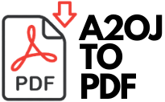

<p align="center">
  <a href="https://github.com/atarax665/a2oj_PDF_downloader">
    
  </a>


## 📌Introduction:
This python script downloads all the contest problems from the (appropriate) A2OJ ladder based on your current codeforces rating. All you need to do is enter your codeforces username. The script will determine the appropriate ladder for you and download all the 100 problems of the ladder in PDF format.

## Idea behind:
If you have been into sport programming you must already know about [A2OJ](https://a2oj.com/). Its the best website to practice questions according to your codeforces rating to advance to become a candidate master or maybe a candidate grandmaster gradually. Though sometimes college gets hectic on the week days and one may have difficulties keeping up with their regualr CP practice. So, I wrote this script to download all the questions in the respective ladder in pdf format so that one can get them printed (few problems at a time) or scroll through the pdfs between boring lectures.

## Requirements (software):
* Python 3.x
* [wkhtmltopdf](https://wkhtmltopdf.org/downloads.html)

## Local Setup:
1. Drop a ⭐ on the Github Repository. 

2. Clone the Repo by going to your local Git Client and pushing in the command: 

```sh
git clone https://github.com/atarax665/a2oj_to_pdf.git
```

3. Install the required packages: 
```sh
pip install -r requirements.txt
```

4. Download the appropriate [wkhtmltopdf](https://wkhtmltopdf.org/downloads.html) zip/installer.

5. Unzip the zip file, we will need the path of ```wkhtmltopdf.exe``` inside the bin folder.

6. Edit ```a2oj_to_pdf.py``` in any text editor and replace wkhtmltopdf.exe's path with the path on your local machine where you just installed/unzipped it.

```sh
config= pdfkit.configuration(wkhtmltopdf= "C:/Users/Atarax/Desktop/wkhtmltox/bin/wkhtmltopdf.exe")
```

7. Edit the Destination folder's path too in ```a20j_to_pdf.py```, add path of the folder you want to save the PDFs to.
```sh
outputDir = 'C:/a20jLadder_pdfs/'
```

8. At last, run a20j_to_pdf.py:
```sh
python a2oj_to_pdf.py
```

9. We are almost done, just enter your codeforces username. e.g - tourist

10. Voila, sit back and enjoy, all the 100 questions in your ladder will be downloaded, converted and saved in the active folder.

## License:
[MIT](LICENSE.md)
